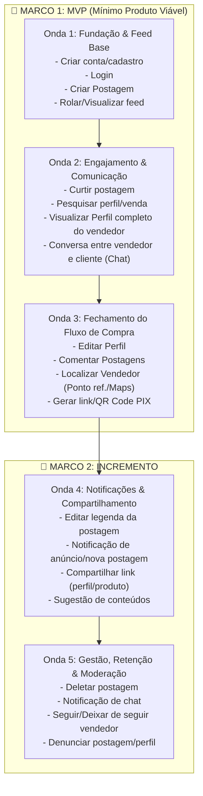

# Sequenciador de Funcionalidades (Lean Inception)

Documento oficial do **Sequenciador de Funcionalidades** do projeto mobile **PA2**, organizado em ondas de desenvolvimento e alinhado aos princípios da Lean Inception.

---

## 📌 Legenda de Avaliação dos Cards

Os cartões foram classificados com base em três eixos de priorização e nível de confiança/complexidade:

* **Esforço de Engenharia ($E$):**
  * `E` = Baixo esforço
  * `EE` = Médio esforço
  * `EEE` = Alto esforço
* **Valor de Negócio ($\$$):**
  * `$` = Baixo valor
  * `$$` = Médio valor
  * `$$$` = Alto valor
* **Valor para o Usuário / Experiência ($\heartsuit$):**
  * `♡` = Baixo valor
  * `♡♡` = Médio valor
  * `♡♡♡` = Alto valor
* **Cores dos Cartões:**
  * 🟢 **Verde:** Alta certeza técnica / requisitos bem mapeados e simples.
  * 🟡 **Amarelo:** Certeza média / requer atenção à integração e design.
  * 🔴 **Vermelho:** Maior complexidade técnica / regras de negócio críticas ou tempo real.

---

## 🌊 Mapeamento das Ondas



---

### 🌊 Onda 1 — Fundação & Feed Essencial
Foco em permitir que os usuários entrem no app, criem seus perfis de acesso e publiquem/consumam conteúdo inicial.

| Cartão / Funcionalidade | Cor | Esforço ($E$) | Valor Negócio ($\$$) | Valor Usuário ($\heartsuit$) | Objetivo na Onda |
| :--- | :---: | :---: | :---: | :---: | :--- |
| **Criar conta / cadastro** | 🟢 Verde | `E` | `$$$` | `♡♡` | Permite cadastro de clientes e comerciantes. |
| **Login** | 🟢 Verde | `E` | `$$$` | `♡♡` | Autenticação segura na aplicação. |
| **Criar Postagem** | 🟡 Amarelo | `EE` | `$$$` | `♡♡♡` | Publicação de fotos e informações de produtos/lanches. |
| **Rolar / Visualizar feed** | 🔴 Vermelho | `EEE` | `$$$` | `♡♡♡` | Interface principal de consumo de anúncios e produtos. |

---

### 🌊 Onda 2 — Interação, Busca & Comunicação
Foco na aproximação entre cliente e vendedor e descoberta de produtos.

| Cartão / Funcionalidade | Cor | Esforço ($E$) | Valor Negócio ($\$$) | Valor Usuário ($\heartsuit$) | Objetivo na Onda |
| :--- | :---: | :---: | :---: | :---: | :--- |
| **Curtir postagem** | 🟢 Verde | `EE` | `$$` | `♡♡♡` | Feedback rápido e engajamento social nos produtos. |
| **Pesquisar perfil / venda** | 🟡 Amarelo | `EE` | `$$$` | `♡♡♡` | Busca por vendedores ou tipos de lanches/produtos. |
| **Visualizar Perfil completo do vendedor** | 🟡 Amarelo | `E` | `$$$` | `♡♡♡` | Exibição de foto, bio, telefone de contato e nome. |
| **Conversa entre vendedor e cliente** | 🔴 Vermelho | `EEE` | `$$$` | `♡♡♡` | Canal de chat direto para tirar dúvidas e combinar retirada. |

---

### 🌊 Onda 3 — Localização, Comentários & Transação (Fechamento do MVP 🎯)
Conclusão da jornada principal de compra: encontrar o vendedor, detalhar pedido e pagar via PIX.

| Cartão / Funcionalidade | Cor | Esforço ($E$) | Valor Negócio ($\$$) | Valor Usuário ($\heartsuit$) | Objetivo na Onda |
| :--- | :---: | :---: | :---: | :---: | :--- |
| **Editar Perfil** | 🟢 Verde | `E` | `$$` | `♡♡♡` | Manutenção de dados de contato e bio pelo vendedor/cliente. |
| **Comentar Postagens** | 🟡 Amarelo | `EE` | `$$` | `♡♡♡` | Interação pública e dúvidas nas publicações. |
| **Localizar Vendedor** | 🟡 Amarelo | `EE` | `$$` | `♡♡♡` | Ponto de referência textual e redirecionamento para Google Maps externo. |
| **Gerar link / QR Code PIX** | 🔴 Vermelho | `EEE` | `$$$` | `♡♡♡` | Viabilização do pagamento direto e instantâneo sem intermediários. |

> 🎯 **Marco do MVP:** Ao final da **Onda 3**, o aplicativo possui o fluxo ponta a ponta validável: Cadastro ➔ Publicação ➔ Feed ➔ Chat ➔ Localização ➔ Pagamento PIX.

---

### 🌊 Onda 4 — Descoberta & Alertas (Incremento 🚀)
Recursos para aumentar a retenção e a velocidade de alcance das postagens.

| Cartão / Funcionalidade | Cor | Esforço ($E$) | Valor Negócio ($\$$) | Valor Usuário ($\heartsuit$) | Objetivo na Onda |
| :--- | :---: | :---: | :---: | :---: | :--- |
| **Editar legenda da postagem** | 🟢 Verde | `E` | `$` | `♡♡♡` | Correção rápida de preços ou descrições de lanches. |
| **Notificação de anúncio / nova postagem** | 🟡 Amarelo | `EE` | `$$$` | `♡♡♡` | Alerta clientes quando seus vendedores favoritos publicam. |
| **Compartilhar link (perfil, produto, etc.)** | 🔴 Vermelho | `EE` | `$$$` | `♡♡` | Divulgação externa via WhatsApp e outras redes. |
| **Sugestão de conteúdos** | 🔴 Vermelho | `EEE` | `$$` | `♡♡` | Algoritmo simples de recomendação no feed. |

---

### 🌊 Onda 5 — Gestão, Relacionamento & Segurança
Aprimoramento de controle da conta, fidelização e moderação comunitária.

| Cartão / Funcionalidade | Cor | Esforço ($E$) | Valor Negócio ($\$$) | Valor Usuário ($\heartsuit$) | Objetivo na Onda |
| :--- | :---: | :---: | :---: | :---: | :--- |
| **Deletar postagem** | 🟢 Verde | `E` | `$` | `♡` | Remoção de itens esgotados ou descontinuados. |
| **Notificação de chat** | 🟡 Amarelo | `EE` | `$$$` | `♡♡♡` | Push notifications de novas mensagens no chat. |
| **Seguir / Deixar de seguir vendedor** | 🟡 Amarelo | `E` | `$$` | `♡♡` | Criação da base de seguidores do comerciante ambulante. |
| **Denunciar postagem / perfil** | 🔴 Vermelho | `EE` | `$` | `♡` | Ferramenta de segurança e moderação contra abusos. |

---

## 🛠️ Roadmap Técnico de Implementação (Flutter & Dart)

```
PA2 Flutter App
 ├── lib/
 │   ├── core/           # Temas, constantes, rotas e utilitários
 │   ├── features/
 │   │   ├── auth/       # Onda 1: Login e Cadastro
 │   │   ├── feed/       # Onda 1 & 4: Feed, Posts e Sugestões
 │   │   ├── profile/    # Onda 2 & 3: Perfil do Vendedor e Edição
 │   │   ├── chat/       # Onda 2 & 5: Mensagens e Notificações de chat
 │   │   ├── payments/   # Onda 3: Geração de chave/QR Code PIX
 │   │   └── moderation/ # Onda 5: Denúncias
 │   └── main.dart
 └── test/               # Testes unitários e de widgets (TDD)
```

### Próximos Passos de Execução:
1. **Setup do Projeto Flutter:** Inicialização da estrutura de pastas, configuração de dependências e gerenciamento de estado.
2. **Execução da Onda 1 (Semana 1):**
   - Implementação das telas e regras de **Cadastro** e **Login**.
   - Implementação do fluxo de **Criar Postagem** (upload de foto, título, valor e descrição).
   - Implementação do **Feed Principal** com scroll infinito e renderização de cards.
   - Testes unitários e de widgets para cada funcionalidade.
